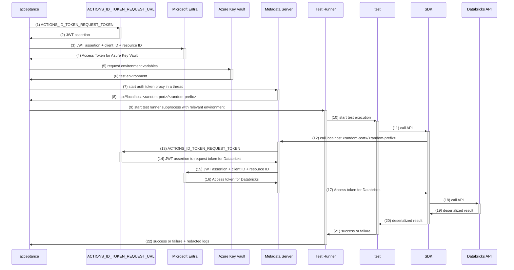

# GitHub Action for Acceptance Testing


- [GitHub Action for Acceptance Testing](#github-action-for-acceptance-testing)
  - [Usage](#usage)
  - [Logs](#logs)
  - [Artifacts](#artifacts)
    - [`event.json`](#eventjson)
    - [`test-report.json`](#test-reportjson)
    - [`go-coverprofile`](#go-coverprofile)
    - [`go-test.out`](#go-testout)
    - [`go-test.err`](#go-testerr)
    - [`pytest-*.out`](#pytest-out)
  - [Usage as library](#usage-as-library)
  - [Troubleshooting](#troubleshooting)
  - [Releasing](#releasing)

Executes tests, comments on PR, links to worflow run, uploads artifacts for later analysis. Only once comment is created per PR and gets edited with subsequent runs.




## Usage

Add a file named `acceptance.yml` to the `.github/workflows` folder in your repository. 
This file defines a GitHub Actions workflow for running acceptance tests on pull requests. 
The workflow sets up the environment, installs dependencies, executes tests, and uploads artifacts for further analysis.

Example `acceptance.yml` for Python projects:

```yaml
name: acceptance

on:
  pull_request:
    types: [ opened, synchronize, ready_for_review ]
  merge_group:
    types: [ checks_requested ]

permissions:
  id-token: write
  contents: read
  pull-requests: write

concurrency:
  group: ${{ github.workflow }}-${{ github.ref }}
  cancel-in-progress: true

jobs:
  acceptance:
    if: github.event_name == 'pull_request'
    runs-on: ubuntu-latest
    steps:
      - name: Checkout
        uses: actions/checkout@v4

      - name: Install Python
        uses: actions/setup-python@v5
        with:
          cache: 'pip'
          cache-dependency-path: '**/pyproject.toml'
          python-version: '3.10'

      - name: Install hatch
        run: pip install hatch==1.9.4

      - name: Run integration tests
        uses: databrickslabs/sandbox/acceptance@acceptance/v0.4.4
        with:
          vault_uri: ${{ secrets.VAULT_URI }}
          timeout: 2h
          # optional path to codegen file containing configuration for the tests
          # by default first `codegen.json` file found in the repository is used
          # codegen_path: tests/integration/.codegen.json
        env:
          GITHUB_TOKEN: ${{ secrets.GITHUB_TOKEN }}
```

Example `.codegen.json`:
```json
{
  "version": {
    "src/databricks/labs/project_name/__about__.py": "__version__ = \"$VERSION\""
  },
  "toolchain": {
    "required": ["python3", "hatch"],
    "pre_setup": ["hatch env create"],
    "prepend_path": ".venv/bin",
    "acceptance_path": "tests/integration"
  }
}
```

Note: if `acceptance_path` is not provided in the `codegen.json`, the action will execute all tests by default.

Example for uploading artifacts to GitHub Actions:
```yaml
name: acceptance

on:
  pull_request:
    types: [opened, synchronize]
    paths: ['go-libs/**']

permissions:
  id-token: write
  contents: read
  pull-requests: write

jobs:
  acceptance:
    if: github.event_name == 'pull_request'
    runs-on: ubuntu-latest
    steps:
      - name: Checkout
        uses: actions/checkout@v4

      - name: Setup Go
        uses: actions/setup-go@v5
        with:
          go-version: 1.21

      - name: Acceptance
        uses: databrickslabs/sandbox/acceptance@actions/artifact
        with:
          directory: go-libs
        env:
          GITHUB_TOKEN: ${{ secrets.GITHUB_TOKEN }}
```

## Logs

If you use `github.com/databrickslabs/sandbox/go-libs/fixtures`, the logs would be available in `go-slog.json` artifact:

```go
import (
	"testing"
	"github.com/databrickslabs/sandbox/go-libs/fixtures"
)

func TestShowDatabases(t *testing.T) {
	ctx, w := fixtures.WorkspaceTest(t)
  // ...
}
```

Python support is coming soon.

## Artifacts

### `event.json`

GitHub Actions raw event information. Example:

```json
{
  "action": "synchronize",
  "after": "faa8a5ba40d987cb981362581e556eb676761161",
  "before": "3d0b4fe5bdc45292358a29dde28718e1605efcad",
  "enterprise": {
    ...
  },
  "number": 69,
  "organization": {
    ...
  },
  "pull_request": {
    "_links": {
```

### `test-report.json`

Normalised integration test execution report across all ecosystems. Example:

```json
{"ts":"2024-02-03T15:28:16.940198637Z","project":"go-libs","package":"sqlexec","name":"TestAccErrorMapping","flaky":false,"pass":false,"skip":true,"output":"=== RUN   TestAccErrorMapping\n    init.go:96: Environment variable CLOUD_ENV is missing\n--- SKIP: TestAccErrorMapping (0.00s)\n","elapsed":0}
{"ts":"2024-02-03T15:28:16.940348556Z","project":"go-libs","package":"sqlexec","name":"TestAccMultiChunk","flaky":true,"pass":true,"skip":false,"output":"...","elapsed":0}
```

### `go-coverprofile`

Code coverage profile for Go applications. Example:

```
mode: set
github.com/databrickslabs/sandbox/go-libs/env/context.go:13.53,15.22 2 0
github.com/databrickslabs/sandbox/go-libs/env/context.go:15.22,17.3 1 0
github.com/databrickslabs/sandbox/go-libs/env/context.go:18.2,18.12 1 0
github.com/databrickslabs/sandbox/go-libs/env/context.go:21.52,22.16 1 0
github.com/databrickslabs/sandbox/go-libs/env/context.go:22.16,24.3 1 0
github.com/databrickslabs/sandbox/go-libs/env/context.go:25.2,26.9 2 0
github.com/databrickslabs/sandbox/go-libs/env/context.go:26.9,28.3 1 0
```

### `go-test.out`

Standard outout from `go test -json` command. Example:

```json
{"Time":"2024-02-03T15:28:06.204157427Z","Action":"start","Package":"github.com/databrickslabs/sandbox/go-libs"}
{"Time":"2024-02-03T15:28:06.204217579Z","Action":"output","Package":"github.com/databrickslabs/sandbox/go-libs","Output":"?   \tgithub.com/databrickslabs/sandbox/go-libs\t[no test files]\n"}
...
```

### `go-test.err`

Standard error from `go test` command. Example:

```
go: downloading github.com/spf13/cobra v1.8.0
go: downloading github.com/fatih/color v1.16.0
go: downloading github.com/spf13/pflag v1.0.5
go: downloading github.com/spf13/viper v1.18.2
go: downloading github.com/stretchr/testify v1.8.4
```

### `pytest-*.out`

Standard output from `pytest`.

## Usage as library

See [`main.go`](main.go) for the example on how to use it within GitHub Action. This is how you can use it in your CLI:

```go
testEnv := testenv.NewWithAzureCLI(vaultURI)
loaded, err := testEnv.Load(ctx)
if err != nil {
  return fmt.Errorf("load: %w", err)
}
ctx, stop, err := loaded.Start(ctx)
if err != nil {
  return fmt.Errorf("start: %w", err)
}
defer stop()
cwd, err := os.Getwd()
if err != nil {
  return fmt.Errorf("cwd: %w", err)
}
// detect and run all tests
report, err := ecosystem.RunAll(ctx, loaded.Redaction(), cwd)
if err != nil {
  return fmt.Errorf("test: %w", err)
}
return fmt.Errorf("failed: %s", report.String())
```

## Troubleshooting

When you need to troubleshoot not the tests, but rather the action itself, locate the following button in the top-right corner:


... and make sure to pick `Enable debug logging` for the failed jobs:


... so that you could view debug level output from this action:


## Releasing

As long as https://github.com/databrickslabs/sandbox is a monorepo, the `acceptance` action has to get a two-step release process:

1. NodeJS shim - edit version file in `shim.js` to pick `v0.0.1` as version in the top of the file.
2. Go module - `git tag acceptance/v0.0.1` and wait till https://github.com/databrickslabs/sandbox/actions/workflows/acceptance-release.yml is complete.

Tag names must start with `acceptance/` in order for [acceptance-release](../.github/workflows/acceptance-release.yml) to trigger and this folder to be used as Go module.