To use the App, click the URL, which will take you to the Home Page

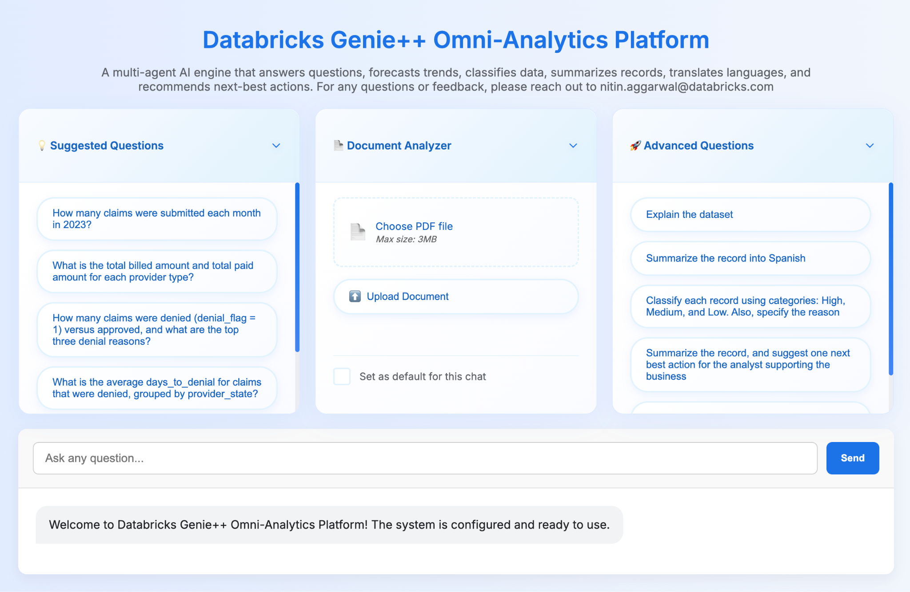

1.  Chat with PDF

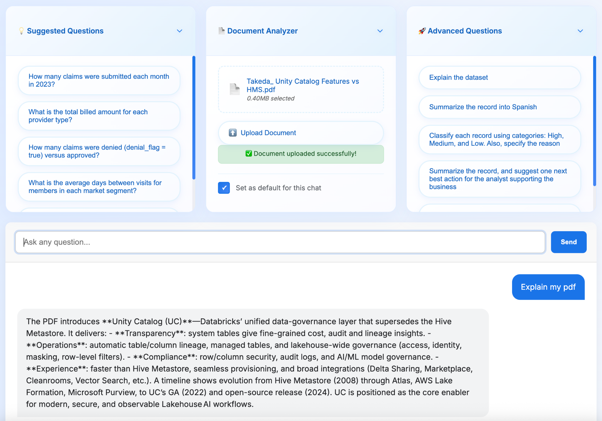

2.  Explain the Dataset

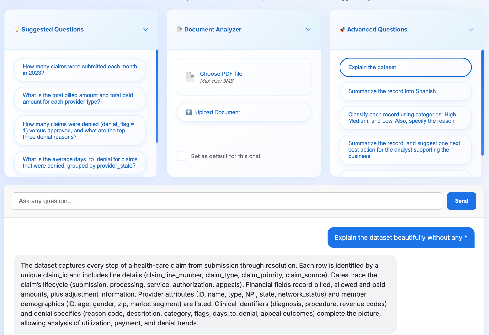

3.  Classification

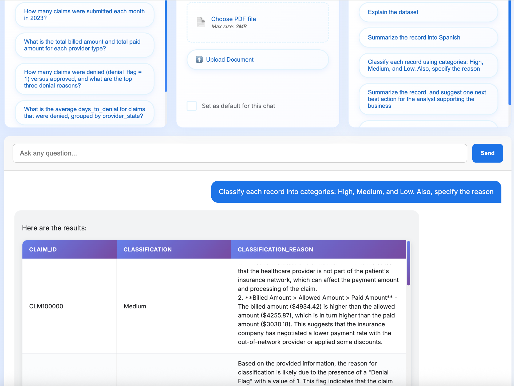

4.  Language Translation

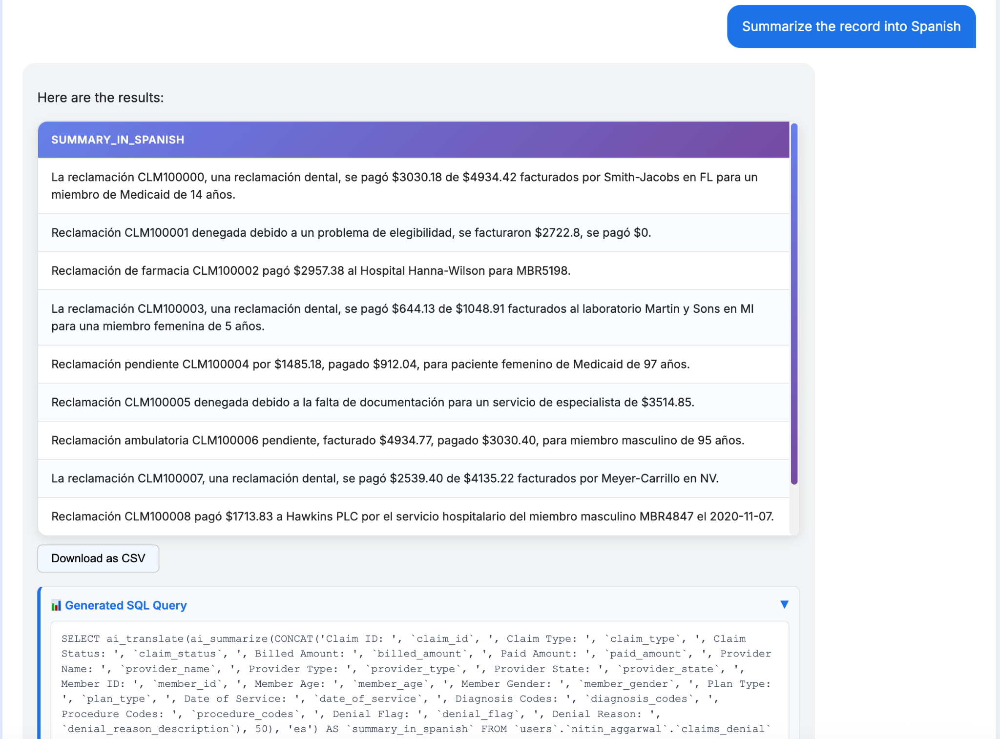

5.  Next Best Action

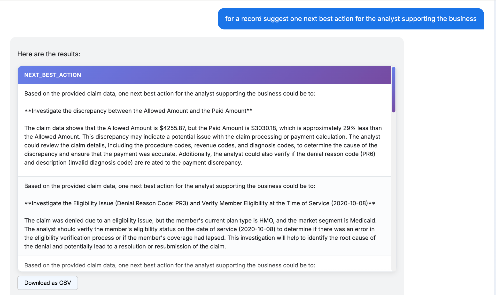

6.  Forecasting

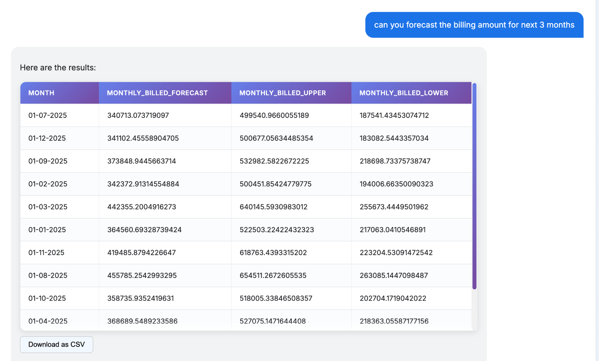

7.  Universal

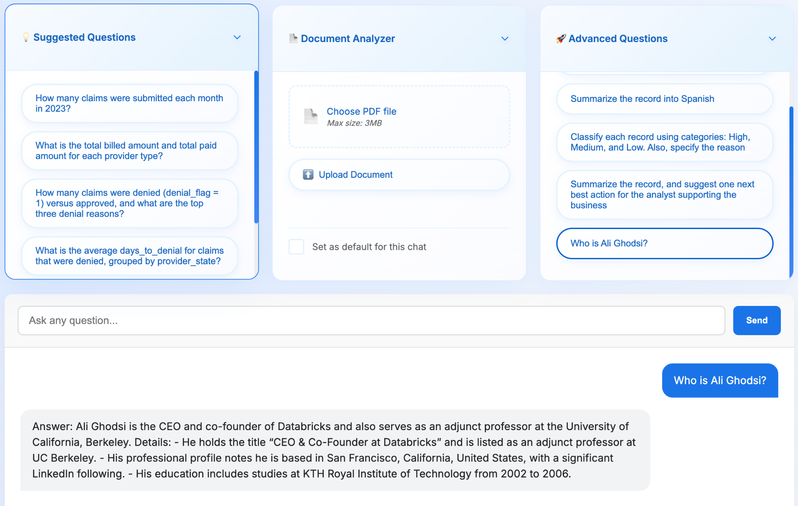

# Claims Analytics with Genie++

Claims Analytics with Genie++ is a conversational analytics application
built on Databricks that enables healthcare teams to analyze insurance
claims using natural language and an analytics-first multi-agent
architecture.

The application extends the Databricks conversational agent framework
and adapts it for healthcare claims analytics using Genie++.

# Overview

Claims Analytics with Genie++ allows analysts, clinicians, and
operations teams to explore healthcare claims data conversationally
while delivering descriptive, predictive, and prescriptive insights.

Key capabilities include:

- Large-scale claims analysis

- Fraud detection and risk forecasting

- Next-best-action recommendations

- Regulatory and compliance support

The application runs natively on Databricks Apps, enabling secure
deployment directly within the Databricks workspace with no
infrastructure management.

# Key Features

- Conversational Analytics -- Query claims datasets using natural
  language

- Stateful Conversations -- Context-aware multi-turn analysis

- Workspace Integration -- Direct access to Genie Spaces, data assets,
  and models

- Document Intelligence -- Upload and analyze claims PDFs

- On-Behalf-Of Authentication -- Secure identity passthrough and
  fine-grained access control

- Serverless Deployment -- Managed hosting, scaling, and security
  through Databricks Apps

## Architecture

### Agentic Analytics Model

The system operates on curated Genie Spaces containing healthcare claims
data and uses an agentic orchestration layer to route queries to
specialized analytics agents.

### Core Components

Genie Space -- Data Foundation

Preprocessed claims data optimized for analytics.

Supervisor Agent

Interprets user intent and routes requests to the appropriate analytics
workflow.

Specialized Analytics Agents

- Descriptive Analytics Agent

- Predictive Analytics Agent

- Prescriptive Recommendation Agent

AI Functions

Forecasting, classification, NLP, and reasoning functions.

Conversational UI

Web interface supporting natural language queries and document analysis.

### Analytics Capabilities

The application delivers a three-tier analytics model.

## Descriptive Analytics

Provides operational visibility into historical claims data.

Examples:

- Claims volume and cost analysis

- Utilization patterns

- Provider performance metrics

- Patient demographic insights

## Predictive Analytics

Applies AI models to forecast risk and outcomes.

Examples:

- Risk stratification

- Healthcare cost forecasting (ai_forecast)

- Readmission prediction

- Fraud probability scoring

## Prescriptive Analytics

Generates actionable recommendations for analysts and care teams.

Examples:

- Optimal treatment pathway suggestions

- Cost reduction strategies

- Care quality improvement recommendations

- Next-best-action guidance

## Workflow

1.  User Query
    A user asks a question or uploads a claims document.

2.  Intent Detection
    The Supervisor Agent classifies the request.

3.  Agent Execution
    Specialized analytics agents perform descriptive, predictive, or
    prescriptive analysis.

4.  AI Processing
    Forecasting, classification, NLP, or reasoning functions are
    executed.

5.  Insight Delivery
    Results are returned with clinical and operational context.

# Additional Capabilities

- Claims Classification -- Risk-based claim categorization

- Language Translation -- Multilingual summarization

- Forecasting -- Monthly claims cost projections with confidence
  intervals

- Next Best Action -- Recommended investigative or operational actions

- Universal Knowledge Mode -- General Q&A using Genie and LLM reasoning

# Benefits

## Unified Analytics Experience

Combine descriptive, predictive, and prescriptive analytics within a
single conversational interface.

## Trusted Data Foundation

Built on curated Genie Spaces to ensure consistent and high-quality
data.

## Operational Efficiency

Real-time insights delivered through scalable cloud-native architecture.

## Clinical and Financial Impact

Improved care decisions, reduced fraud exposure, and stronger regulatory
compliance.

# Deploying the Agent Genie++ App to Databricks Apps

The Agent Genie++ App can be installed through Databricks Marketplace.

1.  Login to your Databricks workspace, Click on Marketplace on the
    left, search for 'agent-genie++'

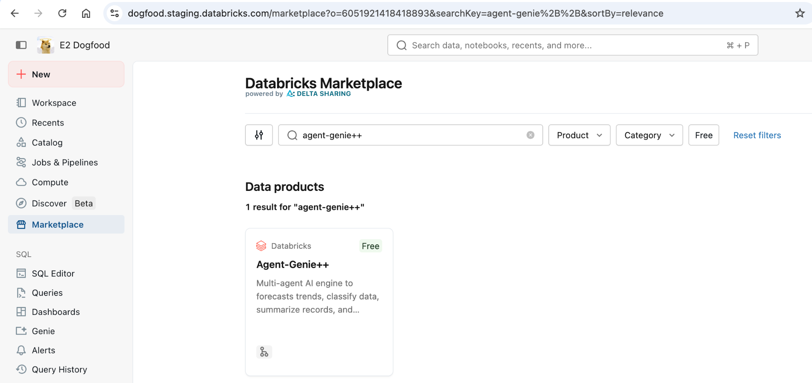

2.  Click Install

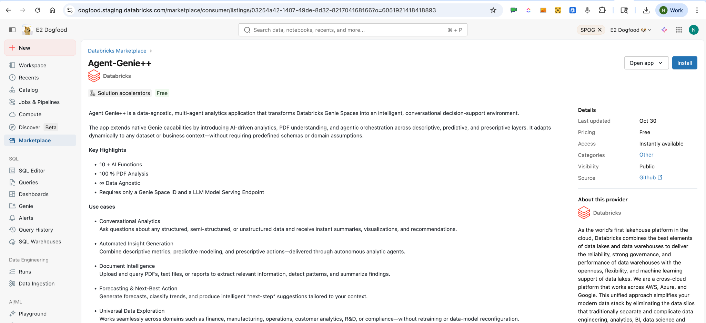

3.  Accept the terms and conditions. Click Continue.

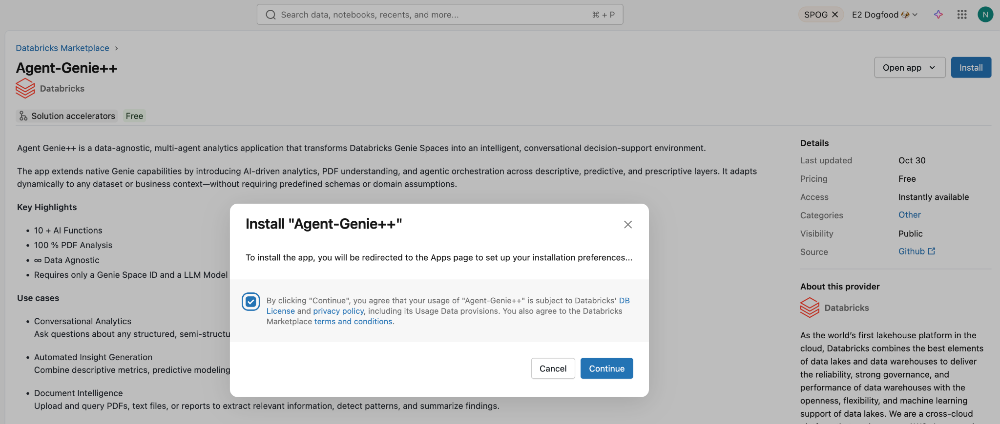

4.  Choose your preferred Serving endpoint, Genie Space, and the App
    Compute Size. Click Next

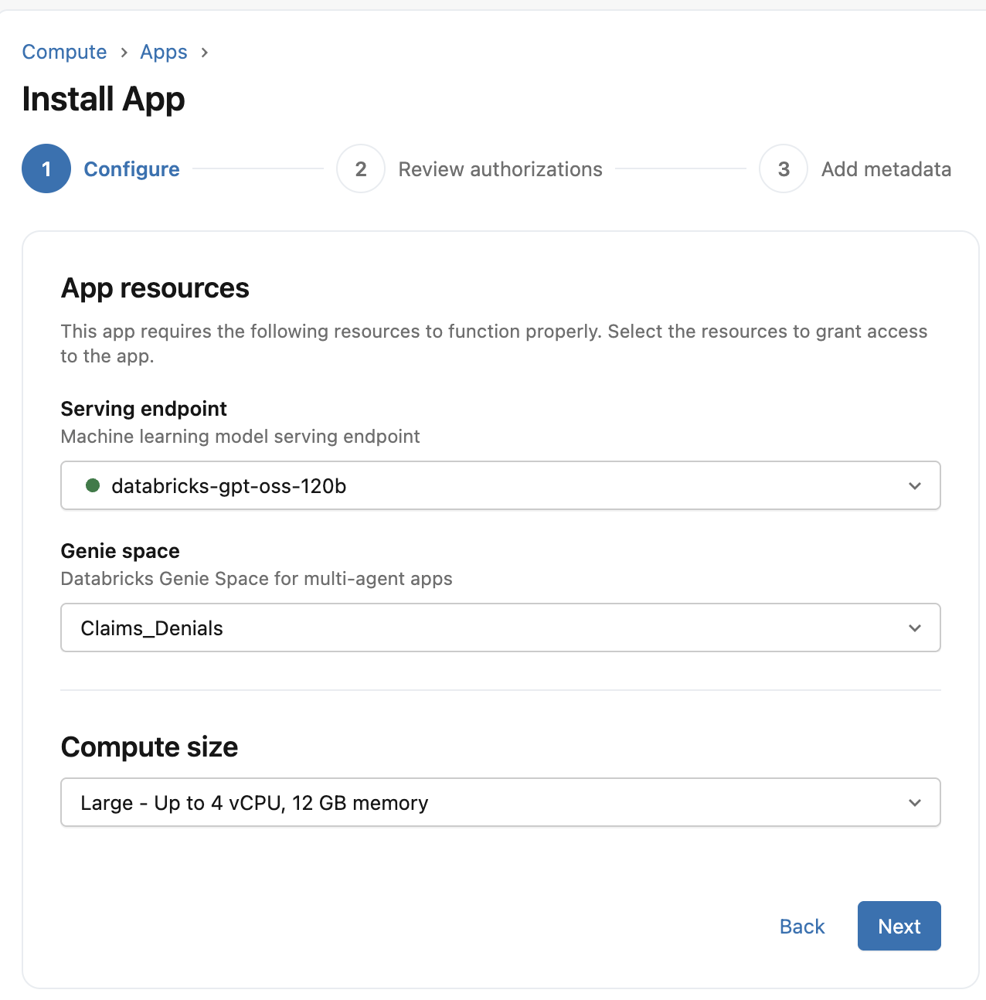

5.  Review the App and User Authorization details. Click Next

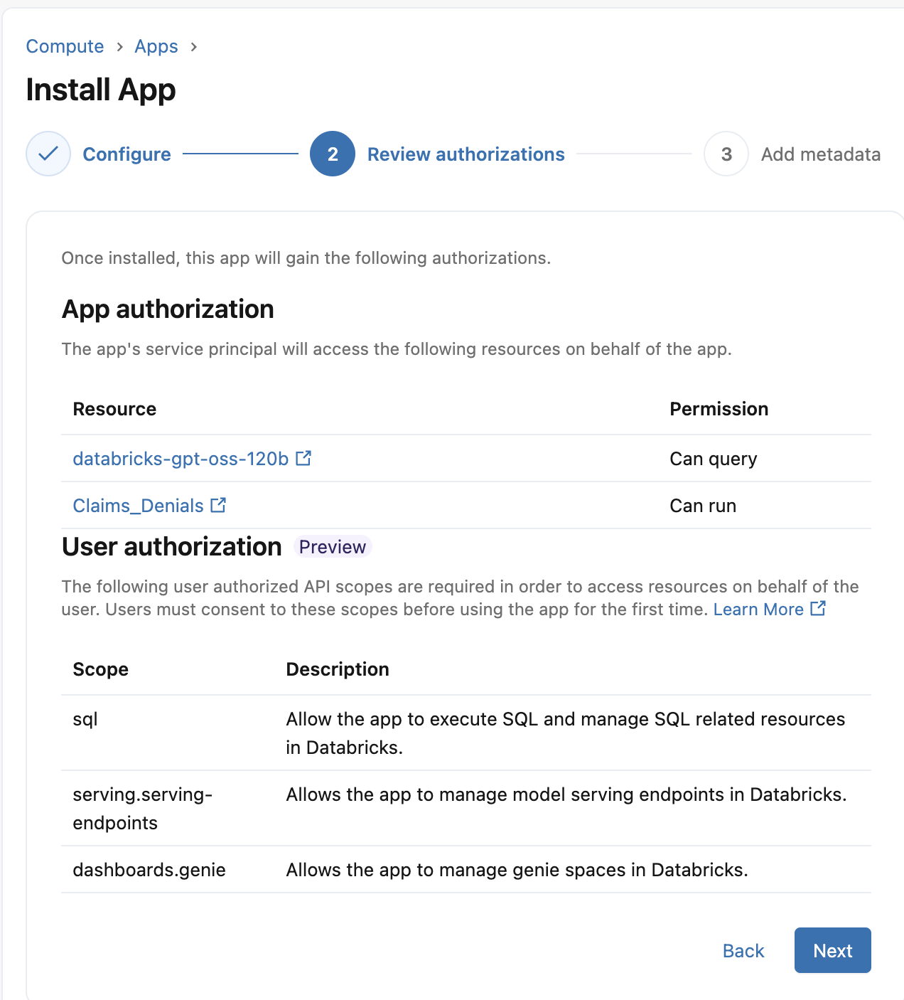

6.  Click Install

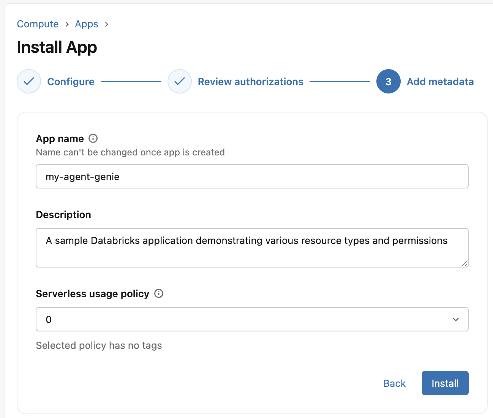

7.  Wait for App Installation to be successful.

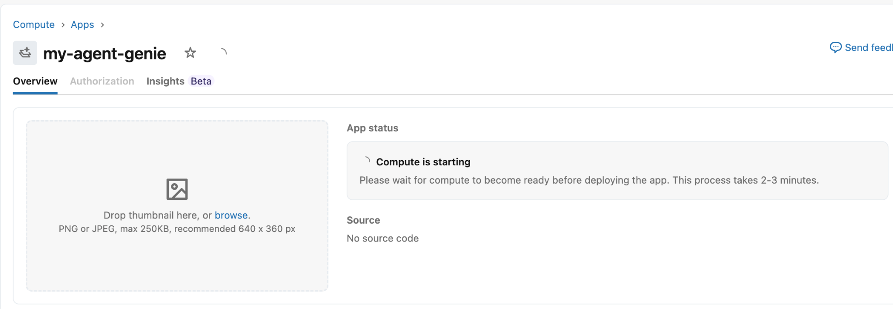

If you prefer to clone and deploy it manually, follow the instructions
below.

# 1. Clone the Agent Genie++ Repository

Clone the repository to your Databricks workspace using Git Folder.

1.  Navigate to the Workspace section in the sidebar.

2.  Click Create.

3.  Select Git Folder.

4.  Enter the Agent Genie++ repository URL and follow the prompts to
    clone it.

This will create a folder in your workspace containing the Agent Genie++
application code and configuration files.

# 2. Create the Agent Genie++ App

1.  Navigate to Compute in the sidebar.

2.  Open the Apps tab.

3.  Click Create App.

4.  Enter the required fields.

Click Next: Configuration.

If you want to reuse an existing Agent Genie++ app:

1.  Click the app name in the Name column.

2.  Open the app details page.

3.  Click Edit.

# 3. Configure App Resources

Inside App Resources, add the required dependencies used by Agent
Genie++.

Click + Add Resource and configure the following:

## Model Serving Endpoint

Add a serving endpoint that hosts the Agent Genie++ orchestration or LLM
model.

- Resource type: Serving Endpoint

- Select your GenAI serving endpoint

- Grant permission: `CAN_QUERY`

- Resource name: `serving_endpoint`

## Genie Space

Add the Genie Space used by Agent Genie++ for enterprise data reasoning.

- Resource type: Genie Space

- Select the relevant Genie space

- Grant permission: `CAN_RUN`

- Resource name: `genie_space`

For detailed instructions on configuring resources, refer to the
Databricks Apps documentation.

# 4. Deploy the Agent Genie++ App

Deploy the application using the Databricks Apps interface.

1.  Go to the app detail page

2.  Click Deploy

3.  Select the Agent Genie++ Git folder

4.  Choose the folder: `agent-genieplusplus-app`

5.  Click Select

6.  Click Deploy

Review the configuration and confirm the deployment.

# 5. Troubleshooting Authorization

After installing the Agent Genie++ App, verify that the correct OAuth
scopes are configured.

Navigate to the Authorization page and confirm the following scopes
exist:

- serving.serving-endpoints

- dashboards.genie

- files.files

- sql

When opening the app for the first time, you should see the OBO
authorization page requesting these scopes.

# Issue: Missing serving.serving-endpoints Scope

If you clone the Git repository directly, you may notice that the scope `serving.serving-endpoints` does not appear in the UI yet.

This is a known UI limitation and will be added later.

# Solution: Manually Add the Scope via CLI

You can manually update the OAuth scopes using the Databricks CLI, API,
or SDK as an Account Admin.

## Step 1: Retrieve OAuth App Client ID

Example client ID: `12345667-1234-5678-a85d-eac774235aea`

Run:

```bash
databricks account custom-app-integration get '12345667-1234-5678-a85d-eac774235aea'
```

Example output:

```json
{
  "client_id": "12345667-1234-5678-a85d-eac774235aea",
  "confidential": true,
  "create_time": "2025-02-18T09:59:07.876Z",
  "integration_id": "abcdefgg-1234-5678-a85d-eac774235aea",
  "name": "agent-genieplusplus-app",
  "redirect_urls": [
    "http://localhost:7070",
    "https://agent-genieplusplus-app.databricksapps.com/.auth/callback"
  ],
  "scopes": [
    "openid",
    "profile",
    "email",
    "all-apis",
    "offline_access"
  ]
}
```

## Step 2: Add the Required Scope

Update the scopes and append `serving.serving-endpoints`.

Example CLI command:

```bash
databricks account custom-app-integration update '65d90ec2-54ba-4fcb-a85d-eac774235aea' \
  --json '{"scopes": ["openid", "profile", "email", "all-apis", "offline_access", "serving.serving-endpoints"]}'
```

## Step 3: Refresh Authentication

If the scope does not immediately reflect in the app:

- Clear browser cookies

- Restart the app

- Reinstall the app

- Or open the URL in incognito mode

# 6. Verify User Permissions

Ensure users have access to all underlying resources used by Agent
Genie++.

## Unity Catalog Permissions

Users must have:

- `USE CATALOG`
- `USE SCHEMA`
- `SELECT` on tables

## Genie Space

Users must have:

- `CAN RUN` permission

## SQL Warehouse

Users must have:

- `CAN USE`

## Model Serving Endpoint

Users must have:

- `CAN QUERY`

# 7. Sharing the Agent Genie++ App

When the app owner shares the application, users will see:

- App Owner

- Sign-in User

These may differ.

This means the app owner is authorizing other users to run the
application.

The owner must grant:

- `CAN USE` permission on the app

- Access to all underlying Databricks resources

# 8. Monitoring Queries

If the Agent Genie++ app is not returning results:

1.  Navigate to the Genie Space

2.  Open the Monitoring page

3.  Verify whether the query was sent to the Genie Room API

Open the query details to inspect:

- execution errors

- permission issues

- API failures

✅ At this point the Agent Genie++ App should be fully operational.
