# Conversational Agent App


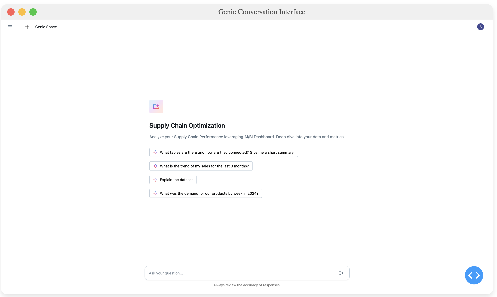
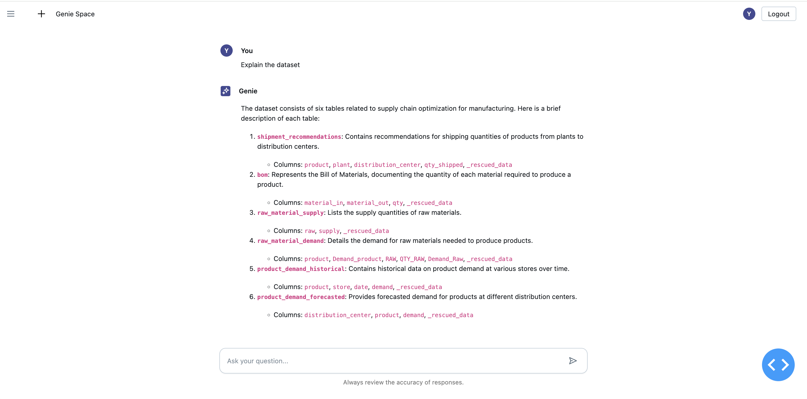


This repository demonstrates how to integrate Databricks' AI/BI Genie Conversation APIs into custom Databricks Apps applications, allowing users to interact with their structured data using natural language.

You can also click the Generate insights button and generate deep analysis and trends of your data.


## Overview

This app is a Dash application featuring a chat interface powered by Databricks Genie Conversation APIs, built specifically to run as a Databricks App. This integration showcases how to leverage Databricks' platform capabilities to create interactive data applications with minimal infrastructure overhead.

The Databricks Genie Conversation APIs (in Public Preview) enable you to embed AI/BI Genie capabilities into any application, allowing users to:
- Ask questions about their data in natural language
- Get SQL-powered insights without writing code
- Follow up with contextual questions in a conversation thread


## Key Features

- **Powered by Databricks Apps**: Deploy and run directly from your Databricks workspace with built-in security and scaling
- **Zero Infrastructure Management**: Leverage Databricks Apps to handle hosting, scaling, and security
- **Workspace Integration**: Access your data assets and models directly from your Databricks workspace
- **Natural Language Data Queries**: Ask questions about your data in plain English
- **Stateful Conversations**: Maintain context for follow-up questions
- **OBO(On-Behalf-Of) Authentication**: User credentials passthrough for fine-grained access control.

## Example Use Case

This app shows how to create a simple interface that connects to the Genie API, allowing users to:
1. Start a conversation with a question about their supply chain data
2. View generated SQL and results
3. Ask follow-up questions that maintain context

## Deploying to Databricks apps

The app can be installed through Databricks Marketplace. If you prefer to clone and deploy it manually, please refer to these instructions: 

1. Clone the repository to your Databricks workspace using [Git Folder](https://docs.databricks.com/aws/en/repos/repos-setup):
   - Navigate to the **Workspace** section in the sidebar.
   - Click on the 'Create' button, select the 'Git Folder' option and follow the prompts to clone the repository.

2. Create an app with a serving endpoint resource.
   - Navigate to the **Compute** section in the sidebar.
   - Go to the Apps tab and click the **Create app** button. Fill in the necessary fields and click **Next: Configuration**
      - To reuse an existing app, click the link to your app in the **Name** column to go to the detail page of the app, then click **Edit**
   - In the App resources section, click **+ Add resource** and select **Serving endpoint**. Choose a chat endpoint, grant **CAN_QUERY** permission and name it 'serving_endpoint'.
   select **Genie Space**. Choose a genie space, grant **CAN_RUN** permission and name it 'genie_space'.
   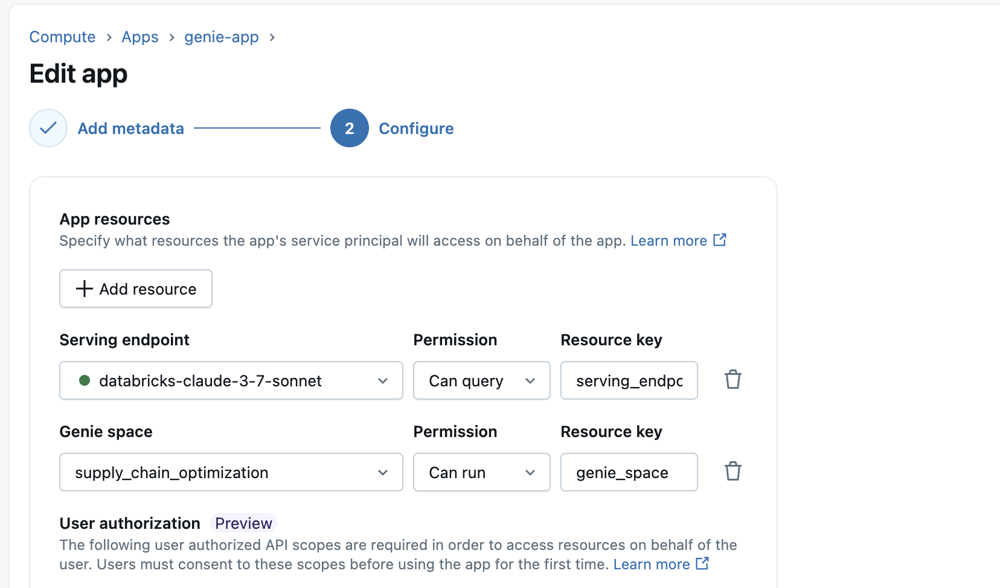

   
For detailed instructions on configuring resources, refer to the [official Databricks documentation](https://docs.databricks.com/aws/en/dev-tools/databricks-apps/resources#configure-resources-for-your-app).

3. Deploy the app using the Databricks Apps interface:
   - Go to the detail page of the app.
   - Click **Deploy** and select the folder 'conversational-agent-app' from the created Git folder.
   - Click **Select**, then **Deploy**.
   - Review the configuration and click **Deploy**.

For more details, refer to the [official Databricks documentation](https://docs.databricks.com/aws/en/dev-tools/databricks-apps/deploy).

## Troubleshooting
1. After you install the app from Marketplace, check the Authorization page for API scope details. 
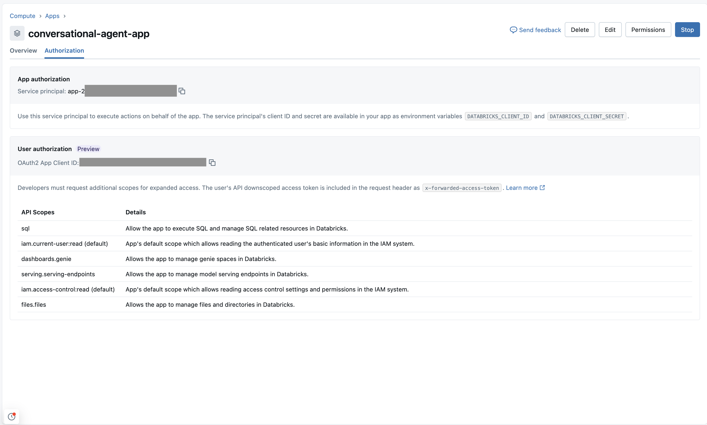

Then you open the url link the first time, ensure that you see this OBO scope authorization page, which has all four scopes:
  - serving.serving-endpoints
  - dashboards.genie
  - files.files
  - sql

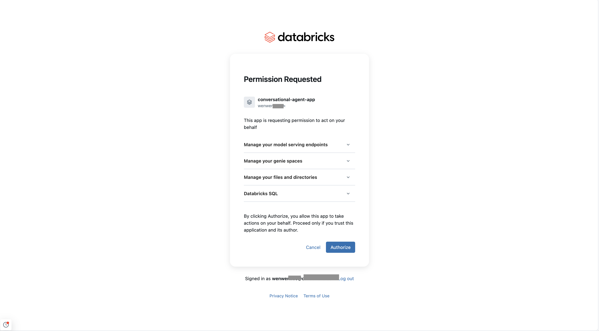


2. If you directly clone the git repo, start an app instance and try to add scope, notice that serving.serving-endpoints is not in the scope list yet in the UI, which is a work-in-progress and will get added later. 
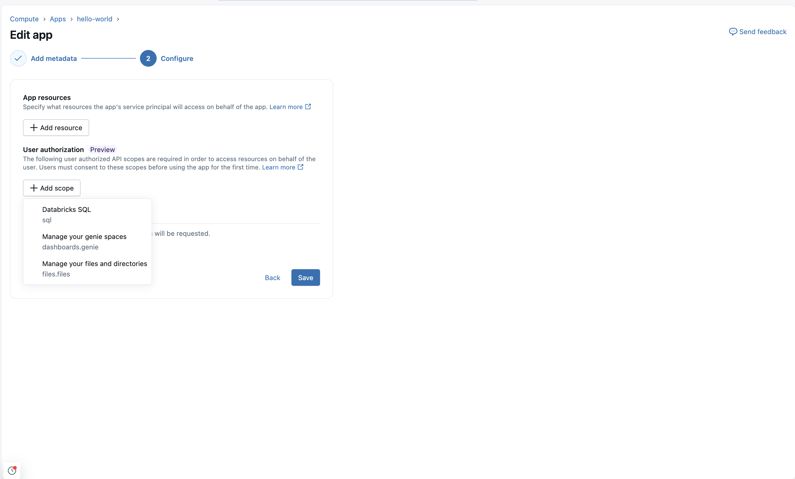

What you need to do is using Databricks API or CLI to manually grant the user serving.serving-endpoints.
To do this, you can use either the [CLI](https://docs.databricks.com/aws/en/dev-tools/cli), [SDK](https://docs.databricks.com/aws/en/dev-tools/sdk-python) or [API](https://docs.databricks.com/api/account/customappintegration/get) as an Account Admin. To show an example using CLI:
 - Take the Oauth2 App client ID:

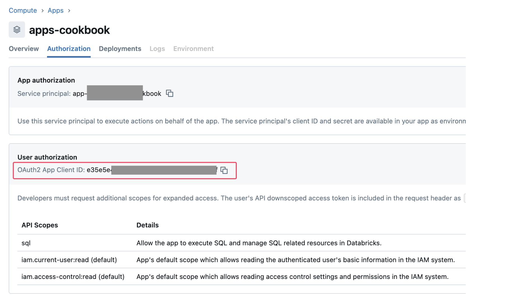

- Pass this to the Databricks CLI command,

```
databricks account custom-app-integration get '12345667-1234-5678-a85d-eac774235aea'

{
  "client_id":"12345667-1234-5678-a85d-eac774235aea",
  "confidential":true,
  "create_time":"2025-02-18T09:59:07.876Z",
  "created_by":4377920341700116,
  "integration_id":"abcdefgg-1234-5678-a85d-eac774235aea",
  "name":"app-abcdeft 1234xp",
  "redirect_urls": [
    "http://localhost:7070",
    "https://mzeni-obo-app-url.azure.databricksapps.com/.auth/callback"
  ],
  "scopes": [
    "openid",
    "profile",
    "email",
    "all-apis",
    "offline_access"
  ],
  "token_access_policy": {
    "access_token_ttl_in_minutes":60,
    "refresh_token_ttl_in_minutes":10080
  }
}
```
 - Update the scopes with below command line, notice you will copy all the original scopes over and add the serving-endpoints at the end:
```
 databricks account custom-app-integration update '65d90ec2-54ba-4fcb-a85d-eac774235aea' --json '{"scopes": ["openid", "profile", "email", "all-apis", "offline_access", "serving.serving-endpoints"]}'
```

 - If it doesn't reflect in the app, clear the cookie in the browser developer tools, and you may need to recreate the app or reinstall. You can also try opening the url in incognito mode.

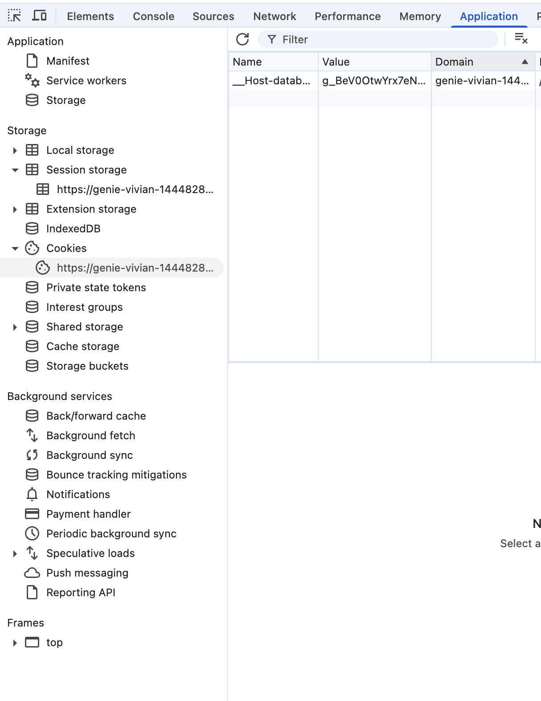


3. Make sure the users have proper access to the underlying resources:
 - For querying tables, users need at least `USE CATALOG` permissions on the Unity catalog and `USE SCHEMA` on the schema, `SELECT` permission on the table 
 - For genie space, users need at least `Can Run` permission 
 - For SQL warehouse, users need at least `Can use` permission 
 - For model serving endpoint, users need at least `Can Query` permission 

4. When you share the app as the app owner with other users, they will see the app owner under Permission Requested and Sign-in user are different, which means the app owner is authoring other users to access the app
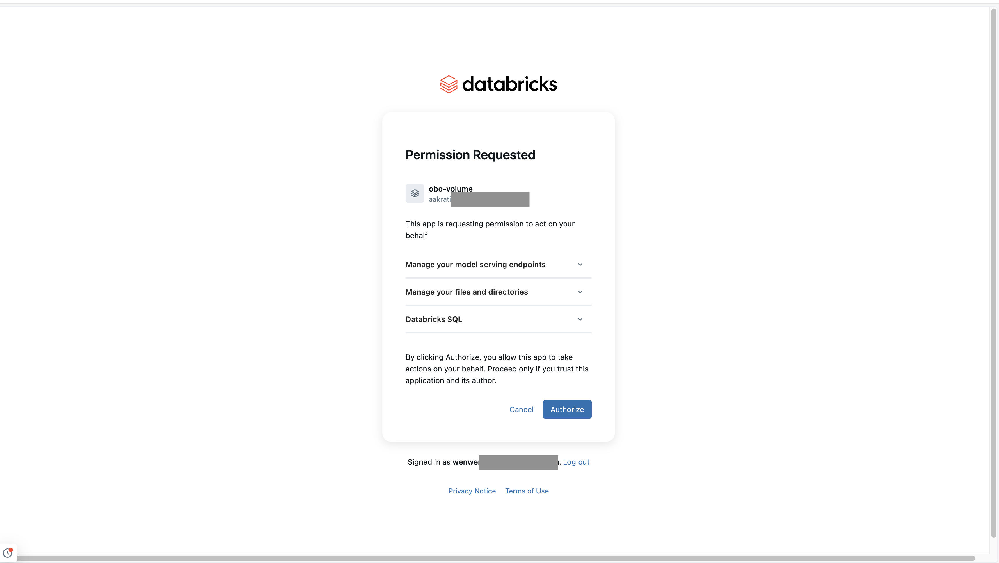

The app owner needs to grant other users `Can Use` permission for the app itself, along with the access to the underlying Datarbricks resources.

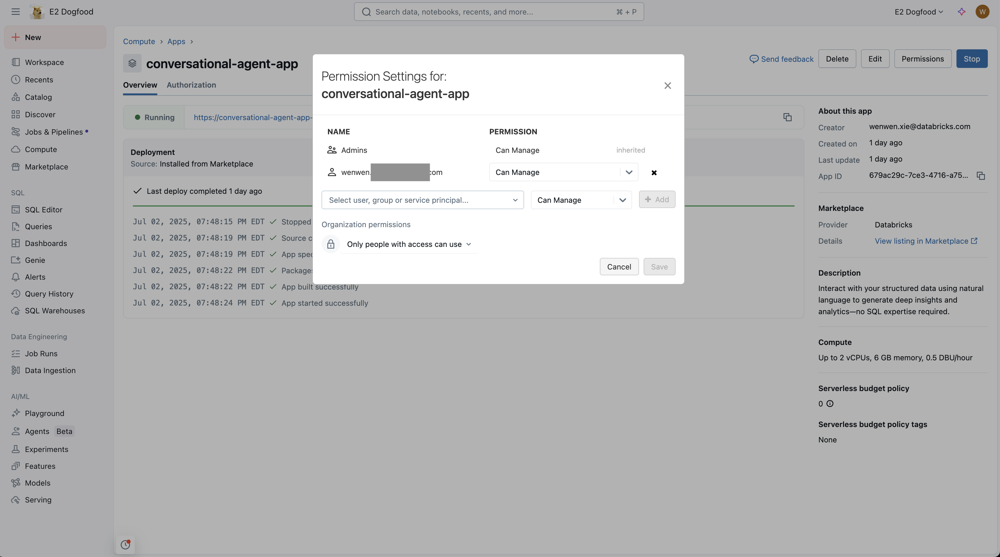

5. For further troubleshooting, navigate to the Monitoring page of the selected genie space and check if the query has been sent successfully to the genie room via the API. 

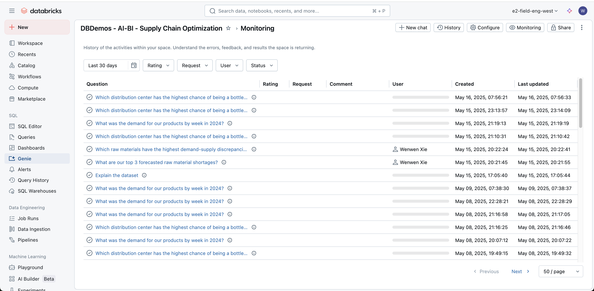

Click open the query and check if there is any error or any permission issues.


## Resources

- [Databricks Genie Documentation](https://docs.databricks.com/aws/en/genie)
- [Conversation APIs Documentation](https://docs.databricks.com/api/workspace/genie)
- [Databricks Apps Documentation](https://docs.databricks.com/aws/en/dev-tools/databricks-apps/)