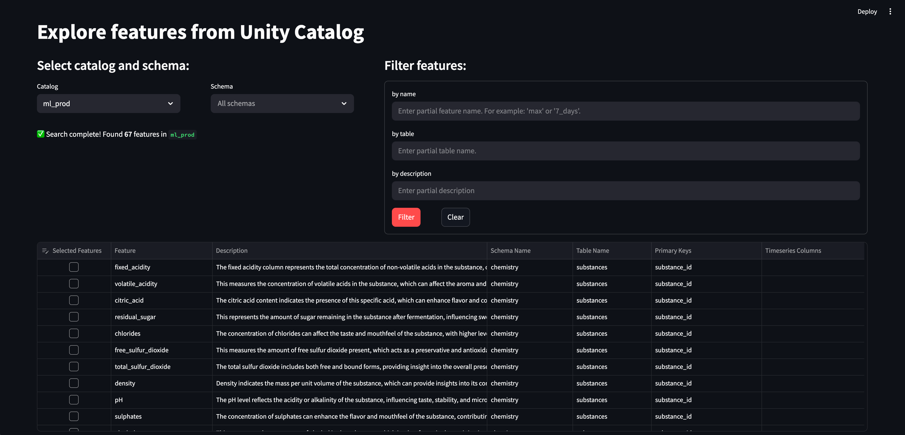

# 🚀 Feature Registry Application

This application provides a modern interface for discovering and managing features with seamless integration to Unity Catalog.

## ✨ Features

- 🔍 List and search for features
- 🔒 On-behalf-of-user authentication
- ⚙️ Code-gen for creating feature specs and training sets

## 🏗️ Architecture

The application is built with:
- 🌟 **Streamlit** for the UI
- 🧱 **Databricks SDK** for interacting with Unity Catalog

## 📸 Example Interface

## 🔑 Requirements

The application requires the following scopes:
- `catalog.catalogs`
- `catalog.schemas`
- `catalog.tables` 

The app owner needs to grant other users `Can Use` permission for the app itself, along with the access to the underlying Datarbricks resources.
