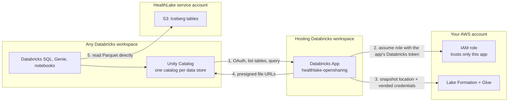

# HealthLake OpenSharing

Query AWS HealthLake FHIR data from Unity Catalog without copying it.

HealthLake OpenSharing is an [OpenSharing](https://docs.databricks.com/aws/en/delta-sharing/) (Delta Sharing) server that runs as a Databricks App. It reads HealthLake's Iceberg analytics tables through AWS Lake Formation credential vending and serves them to Unity Catalog. Each HealthLake data store becomes a catalog that you can grant, query with Databricks SQL, use from notebooks, and point Genie at.

The server is one Python file, deployed with a Databricks Asset Bundle.

## Contents

- [Why a sharing server](#why-a-sharing-server)
- [How it works](#how-it-works)
- [Features and limitations](#features-and-limitations)
- [Prerequisites](#prerequisites)
- [Deploy](#deploy)
- [Configuration](#configuration)
- [Querying the data](#querying-the-data)
- [Scaling](#scaling)
- [Security](#security)
- [Troubleshooting](#troubleshooting)
- [Uninstall](#uninstall)
- [Development](#development)

## Why a sharing server

HealthLake stores its analytics tables (Apache Iceberg, one table per FHIR resource type) in an S3 bucket owned by a HealthLake service account. That bucket's policy denies customer IAM roles, so Unity Catalog storage credentials and Glue federation can see the tables but cannot read their files. The only way in is Lake Formation's `GetTemporaryGlueTableCredentials`, which vends short-lived credentials scoped to one table. Unity Catalog does not call that API.

OpenSharing's data plane is presigned URLs, and anyone holding vended credentials can produce them. So when Unity Catalog asks for a table, this server vends credentials, resolves the table's current Iceberg snapshot, and returns presigned URLs for its Parquet files. Databricks compute downloads the files directly from S3. No data passes through the server.

## How it works



- **Unity Catalog to the app.** The Unity Catalog provider uses OAuth client credentials against the hosting workspace's `/oidc/v1/token`. The Databricks Apps gateway validates the token and checks `CAN_USE`. The server then accepts only one caller, the recipient service principal you configure.
- **The app to AWS.** Databricks workspaces publish standard OIDC discovery, so AWS IAM can trust a workspace as an identity provider. The app presents its own Databricks token to `sts:AssumeRoleWithWebIdentity`, and the role's trust policy allows only that app. No AWS secret exists anywhere, and the role has no S3 permissions.

## Features and limitations

Supported:
- Every Iceberg table HealthLake publishes for a data store (108 FHIR resource types in our test data store), with full nested FHIR schemas.
- Many data stores, in one or more AWS accounts. Data stores are discovered through the HealthLake API, and new ones appear within 5 minutes.
- Unity Catalog grants, Databricks SQL, notebooks, dashboards, and Genie over the shared catalogs.

Freshness: the server looks up each table's current snapshot on every request, so it adds no delay of its own. New FHIR writes appear when HealthLake's analytics pipeline commits a new snapshot. That took 4 to 6 minutes in our tests, and AWS publishes no target for it.

Not supported:
- Time travel and change data feed. These requests fail with a clear error instead of returning current data.
- Predicate pushdown. Every query reads all of a table's files.
- Streaming reads.

## Prerequisites

- **AWS**
  - One or more ACTIVE HealthLake data stores. HealthLake shares each one into your account as a Glue resource link named `<data store name>_<data store id>_healthlake_view`.
  - Lake Formation **Allow full table external data access** turned on in that account: Lake Formation console, Administration, Data lake settings, External data access.
  - Permission to create an IAM role and OIDC provider, and to grant Lake Formation permissions on the resource links.
- **Databricks**
  - A workspace with Databricks Apps where you can create a service principal (the hosting workspace).
  - `CREATE PROVIDER` and `CREATE CATALOG` on the metastore where you want the catalogs. That can be a different workspace and metastore.
- **Tools:** Databricks CLI 1.17 or later, AWS CLI v2.

## Deploy

Set these once. The role does not need to exist yet.

```bash
export AWS_REGION=us-east-1
export AWS_ACCOUNT_ID=123456789012               # account that holds the HealthLake data stores
export ROLE_NAME=healthlake-opensharing-reader
export ROLE_ARN=arn:aws:iam::${AWS_ACCOUNT_ID}:role/${ROLE_NAME}
```

### 1. Create the recipient service principal

Unity Catalog connects to the server as this service principal.

```bash
databricks service-principals create --display-name healthlake-opensharing-recipient -o json
export RECIPIENT_ID=<id from the output>
export RECIPIENT_APP_ID=<applicationId from the output>
```

### 2. Deploy the app

The bundle reads its variables from `BUNDLE_VAR_*` environment variables, so `deploy`, `run`, and `destroy` all pick them up.

```bash
git clone https://github.com/databrickslabs/sandbox.git
cd sandbox/healthlake-opensharing

export BUNDLE_VAR_aws_region=${AWS_REGION}
export BUNDLE_VAR_aws_role_arns=${ROLE_ARN}
export BUNDLE_VAR_recipient_sp_application_id=${RECIPIENT_APP_ID}
databricks bundle deploy
databricks bundle run healthlake_opensharing
```

### 3. Let the app into AWS

The app logs its identity at startup. These three values go into the IAM trust policy:

```bash
databricks apps logs healthlake-opensharing --tail-lines 500 | grep DATABRICKS_IDENTITY
# DATABRICKS_IDENTITY {"iss": "https://<workspace-host>/oidc", "aud": ["<workspace-id>"], "sub": "<app-client-id>"}

export ISSUER=<workspace-host>/oidc              # iss without https://
export WORKSPACE_ID=<workspace-id>               # aud
export APP_CLIENT_ID=<app-client-id>             # sub
```

Trust the workspace as an OIDC provider. Skip this if your account already has a provider for this workspace.

```bash
aws iam create-open-id-connect-provider --url https://${ISSUER} --client-id-list ${WORKSPACE_ID}
```

Create the role. Only this app can assume it.

```bash
cat > trust.json <<EOF
{
  "Version": "2012-10-17",
  "Statement": [{
    "Effect": "Allow",
    "Principal": {"Federated": "arn:aws:iam::${AWS_ACCOUNT_ID}:oidc-provider/${ISSUER}"},
    "Action": "sts:AssumeRoleWithWebIdentity",
    "Condition": {"StringEquals": {"${ISSUER}:sub": "${APP_CLIENT_ID}", "${ISSUER}:aud": "${WORKSPACE_ID}"}}
  }]
}
EOF
cat > policy.json <<EOF
{
  "Version": "2012-10-17",
  "Statement": [
    {"Effect": "Allow", "Action": ["glue:GetDatabase", "glue:GetDatabases", "glue:GetTable", "glue:GetTables"], "Resource": "*"},
    {"Effect": "Allow", "Action": ["lakeformation:GetDataAccess", "lakeformation:GetTemporaryGlueTableCredentials"], "Resource": "*"},
    {"Effect": "Allow", "Action": ["healthlake:ListFHIRDatastores"], "Resource": "*"}
  ]
}
EOF
aws iam create-role --role-name ${ROLE_NAME} --assume-role-policy-document file://trust.json
aws iam put-role-policy --role-name ${ROLE_NAME} --policy-name healthlake-opensharing --policy-document file://policy.json
```

Grant the role Lake Formation access to each data store. Find the resource link and its target:

```bash
aws healthlake list-fhir-datastores --filter DatastoreStatus=ACTIVE \
  --query 'DatastorePropertiesList[].[DatastoreName,DatastoreId]' --output text

export LINK=<data_store_name>_<data-store-id>_healthlake_view   # name in lowercase, other characters as _
aws glue get-database --name ${LINK} --query Database.TargetDatabase
export TARGET_ACCOUNT=<CatalogId from the output>
export TARGET_DB=<DatabaseName from the output>
```

Then grant `DESCRIBE` on the link and `SELECT` on every table it points to. Repeat for each data store.

```bash
aws lakeformation grant-permissions --principal DataLakePrincipalIdentifier=${ROLE_ARN} \
  --permissions DESCRIBE --resource "{\"Database\": {\"Name\": \"${LINK}\"}}"
aws lakeformation grant-permissions --principal DataLakePrincipalIdentifier=${ROLE_ARN} \
  --permissions SELECT DESCRIBE \
  --resource "{\"Table\": {\"CatalogId\": \"${TARGET_ACCOUNT}\", \"DatabaseName\": \"${TARGET_DB}\", \"TableWildcard\": {}}}"
```

If Lake Formation rejects the role as an invalid principal, wait a minute for IAM to propagate and retry. The app needs no redeploy; it assumes the role on its next request.

### 4. Mount the data in Unity Catalog

Create an OAuth secret for the recipient service principal, on the hosting workspace:

```bash
databricks service-principal-secrets-proxy create ${RECIPIENT_ID} -o json   # note "secret"
databricks apps get healthlake-opensharing -o json                       # note "url"
```

Register the app as a provider on the workspace where you want the catalogs. `tokenEndpoint` is always the hosting workspace.

```bash
cat > provider-profile.json <<EOF
{
  "shareCredentialsVersion": 2,
  "type": "oauth_client_credentials",
  "endpoint": "<app url>/delta-sharing",
  "tokenEndpoint": "https://<hosting-workspace-host>/oidc/v1/token",
  "clientId": "${RECIPIENT_APP_ID}",
  "clientSecret": "<secret>",
  "scope": "all-apis"
}
EOF
databricks providers create healthlake_opensharing OAUTH_CLIENT_CREDENTIALS \
  --recipient-profile-str "$(cat provider-profile.json)"
rm provider-profile.json
databricks providers list-shares healthlake_opensharing   # one share per data store
```

Create a catalog per share, grant it, and query. The tables appear within about a minute of creating the catalog.

```sql
CREATE CATALOG healthlake_<data_store> USING SHARE healthlake_opensharing.<share>;
GRANT USE CATALOG, USE SCHEMA, SELECT ON CATALOG healthlake_<data_store> TO `clinical-analysts`;

SELECT gender, count(*) FROM healthlake_<data_store>.fhir.patient GROUP BY gender;
```

## Configuration

Bundle variables, set as `BUNDLE_VAR_<name>` environment variables (or `--var name=value`):

| Variable | Default | Meaning |
|---|---|---|
| `aws_region` | required | Region of the HealthLake data stores |
| `aws_role_arns` | required | Role the app assumes. For data stores in several AWS accounts, list one role per account, comma-separated (see below). |
| `recipient_sp_application_id` | required | Service principal Unity Catalog connects as. It gets `CAN_USE` and is the only caller the server accepts. |
| `app_name` | `healthlake-opensharing` | App name. Change it to run several servers in one workspace. |
| `layout` | `share` | `share`: one share (catalog) per data store. `schema`: one share with a schema per data store. |
| `stores` | `*` | Data stores to serve and their share names, e.g. `demo=databricks-healthlake-integration`. `*` serves every ACTIVE data store the role can see. An entry can name the resource link directly. |
| `instances` | `1` | App instances, 1 to 5. With 2 or more, redeploys are close to zero-downtime. |

Use the environment variables for comma-separated values; `--var` splits values on commas. For example: `export BUNDLE_VAR_aws_role_arns=arn:...:role/a,arn:...:role/b`.

**Layouts.**
- `share` (the default) gives every data store its own catalog, `healthlake_<data_store>.fhir.<resource>`. A new data store stays invisible until someone creates its catalog and grants it. Unity Catalog allows 1,000 catalogs per metastore.
- `schema` puts all data stores in one catalog, `<catalog>.<data_store>.<resource>`. Catalog grants then cover new data stores automatically. In our testing, Unity Catalog kept only 5,000 tables of one shared catalog, about 45 data stores, so use it for small numbers of stores.

**Data stores in other AWS accounts.** Repeat step 3 in each account, then pass every role in `aws_role_arns` and redeploy. The app discovers each account's data stores with that account's role. Deploy one app per organization: every caller the server accepts can read every data store it serves.

## Querying the data

HealthLake's analytics tables only append. A FHIR delete adds a row that has only `id` and `meta.lastUpdated` set, and the resource's earlier row stays. In our test data store, `patient` had 51 rows for 49 live patients. To match what the FHIR API returns, keep the newest row per `id` and drop the delete markers. Shared catalogs are read-only, so create the view in a catalog you own:

```sql
CREATE OR REPLACE VIEW main.fhir.patient_current AS
SELECT *
FROM healthlake_<data_store>.fhir.patient
QUALIFY row_number() OVER (PARTITION BY id ORDER BY CAST(meta.lastUpdated AS TIMESTAMP) DESC) = 1
    AND meta.versionId IS NOT NULL;
```

We verified this for deletes. We expect updates to append the same way, but did not test them.

FHIR observations use LOINC codes. For example, A1C is `code.coding[0].code = '4548-4'` in the `observation` table.

## Scaling

Measured on one Medium app (2 vCPU) with 2 uvicorn workers. The app and HealthLake were in us-east-1 and the SQL warehouse in us-west-2.

| Measurement | Result |
|---|---|
| Databricks SQL, `patient` group-by (warm) | about 2.5 s, mostly Unity Catalog planning and one sharing round trip per table |
| Databricks SQL, two-table join (warm) | about 4.8 s |
| `/query` throughput, 64 concurrent requests | 96 requests per second |
| 101 data stores, 1,080 tables loaded cold | no errors or throttling; 645 MB peak memory per worker |

- **Instances.** For more throughput or zero-downtime redeploys, set `instances` to 2 to 5.
- **Compute size.** For hundreds of busy data stores, give the app the Large compute size. Each cached table snapshot takes about 0.4 MB, up to 2,048 tables per worker.
- **Glue `GetTable`.** The server makes one call per request, so a new snapshot shows up immediately. In our shared test account, Glue flattened at about 100 calls per second.
- **Response size.** Responses are gzip-compressed; FHIR schemas make the uncompressed metadata 100 to 600 KB per table.
- **Same region.** Keep the SQL warehouses in the same region as HealthLake. Parquet files go straight from S3 to compute, so that is where data transfer happens; the app's region affects only latency.

## Security

- **Who can call the server.** The Apps gateway requires a valid OAuth token and `CAN_USE` on the app. On top of that, the server rejects every caller except the recipient service principal. This matters because presigned URLs bypass Unity Catalog grants: anyone who could call the server directly could read every table. Keep `CAN_MANAGE` on the app limited to administrators.
- **What the server can read.** Its role holds `SELECT` on every table of every data store it serves, and Lake Formation narrows each vend to one table. The server is the credential boundary, so protect the hosting workspace accordingly.
- **Governance.** HealthLake's Lake Formation grants are full-table, with no column masks or row filters. Apply PHI controls in Unity Catalog: grants on the shared catalogs, and views over the shared tables for row filters and column masks.
- **Presigned URLs.** Each URL covers one file and expires within an hour, never later than the credentials that signed it.
- **Audit.**
  - App logs record caller, path, status, and latency for each request.
  - Lake Formation credential vends appear in CloudTrail.
  - Queries appear in Unity Catalog query history and `system.access.audit` on the consumer workspace.
- **Compliance.** Databricks Apps are supported on workspaces with the [HIPAA compliance security profile](https://docs.databricks.com/aws/en/security/privacy/hipaa).

## Troubleshooting

| Symptom | Cause and fix |
|---|---|
| `LAKE_FORMATION_ACCESS_DENIED` (403) | Full table external data access is off, or the role lacks grants on that data store. Check the Lake Formation settings and step 3. |
| `AWS_ERROR` mentioning `AssumeRoleWithWebIdentity` | The role does not exist yet, or its trust policy has the wrong `sub` or `aud`. Compare it with the `DATABRICKS_IDENTITY` log line. |
| `PERMISSION_DENIED` (403) | The caller is not the recipient service principal. |
| 302 redirect to a login page | The token is missing or invalid, or the service principal lacks `CAN_USE` on the app. |
| A data store is missing | Look for a `WARNING` line in `databricks apps logs`: no Lake Formation grant yet, or no resource link with the expected name. The `stores` variable can name the link directly. |
| `TABLE_OR_VIEW_NOT_FOUND` for some data stores with `layout=schema` | The shared catalog hit Unity Catalog's table limit. Use `layout=share`. |

`GET /status` on the app returns its identity, roles, layout, data stores, and memory use. The Apps gateway answers `/healthz` itself, so that path never reaches the app.

## Uninstall

```sql
DROP CATALOG healthlake_<data_store>;
DROP PROVIDER healthlake_opensharing;
```

```bash
aws lakeformation revoke-permissions --principal DataLakePrincipalIdentifier=${ROLE_ARN} \
  --permissions DESCRIBE --resource "{\"Database\": {\"Name\": \"${LINK}\"}}"
aws lakeformation revoke-permissions --principal DataLakePrincipalIdentifier=${ROLE_ARN} \
  --permissions SELECT DESCRIBE \
  --resource "{\"Table\": {\"CatalogId\": \"${TARGET_ACCOUNT}\", \"DatabaseName\": \"${TARGET_DB}\", \"TableWildcard\": {}}}"
aws iam delete-role-policy --role-name ${ROLE_NAME} --policy-name healthlake-opensharing
aws iam delete-role --role-name ${ROLE_NAME}

databricks bundle destroy        # with the BUNDLE_VAR_* variables from step 2 set
databricks service-principals delete ${RECIPIENT_ID}
```

Revoke the Lake Formation grants for each data store before deleting the role; Lake Formation keeps grants for deleted roles. HealthLake data stores are not touched.

## Development

The tests run the server against in-memory fakes of Glue, Lake Formation, HealthLake, and S3, and need no cloud access:

```bash
python -m venv .venv && .venv/bin/pip install -r app/requirements.txt && .venv/bin/pip install pytest httpx
.venv/bin/python -m pytest tests -q
```

`app/requirements.txt` is a hashed lockfile generated from `app/requirements.in`:

```bash
uv pip compile app/requirements.in --universal --python-version 3.11 --generate-hashes -o app/requirements.txt
```

## Disclaimer

This project is provided for your exploration only and is not formally supported by Databricks with Service Level Agreements (SLAs). It is provided AS-IS, and we make no guarantees of any kind. Please do not submit a support ticket for issues arising from its use. File issues as GitHub Issues on the repository; they are reviewed as time permits, without formal SLAs.
