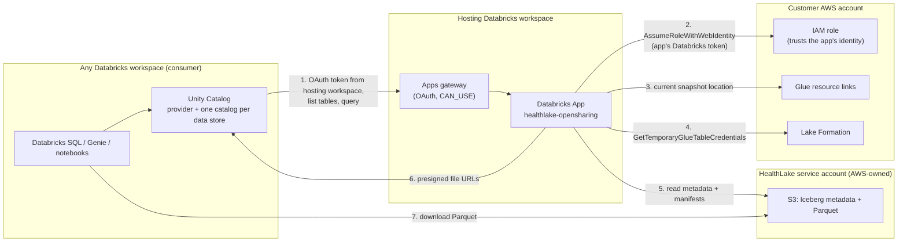

# HealthLake OpenSharing

Query AWS HealthLake FHIR data from Unity Catalog without copying it. A small OpenSharing server runs as a Databricks App, reads HealthLake's Iceberg analytics tables through AWS Lake Formation credential vending, and serves them to Unity Catalog. Each HealthLake data store becomes a catalog that you can grant, query with Databricks SQL, and point Genie at.

## Why a sharing server

HealthLake keeps its analytics tables (Apache Iceberg, one table per FHIR resource type) in an S3 bucket owned by a HealthLake service account. That bucket's policy denies customer IAM roles, so Unity Catalog storage credentials and Glue federation can see the tables but cannot read their files. The only way in is Lake Formation's `GetTemporaryGlueTableCredentials`, which vends short-lived credentials scoped to one table. Unity Catalog does not call that API.

OpenSharing's data plane is presigned URLs, and anyone holding vended credentials can produce those. So when Unity Catalog asks for a table, this server vends credentials, resolves the table's current Iceberg snapshot, and returns presigned URLs for its Parquet files. Databricks compute downloads the files directly from S3. No data passes through the server.

## How it works



| Direction | How it authenticates |
|---|---|
| Unity Catalog to the app | The provider uses OAuth client credentials against the hosting workspace's `/oidc/v1/token` with `scope: all-apis`. The Apps gateway validates the token and checks `CAN_USE`, and the server then accepts only the configured recipient service principal. The server mints no tokens. |
| The app to AWS | The workspace publishes standard OIDC discovery, so AWS IAM trusts it as an identity provider. The app presents its own Databricks token to `sts:AssumeRoleWithWebIdentity`. The role's trust policy pins `sub` (the app's service principal) and `aud` (the workspace ID). No AWS secret exists anywhere. |

The AWS side is one IAM role per account (plus the account's OIDC provider for the workspace) and two Lake Formation grants per data store. The role has no S3 permissions; every byte is read with vended credentials.

## What it supports

- Every Iceberg table HealthLake publishes for a data store (108 FHIR resource types in our test store), with full nested FHIR schemas.
- Many data stores, in one or more AWS accounts. Data stores are discovered through the HealthLake API, and new ones appear within 5 minutes.
- Unity Catalog grants, Databricks SQL, notebooks, dashboards, and Genie over the shared catalogs.

Freshness: the server looks up each table's current snapshot on every request, so it adds no delay. New FHIR writes appear when HealthLake's own analytics pipeline commits a new snapshot. That took 4 to 6 minutes in our tests, and AWS publishes no target for it.

Deletes stay in the tables. HealthLake's analytics tables only append: a FHIR delete adds a marker row (only `id` and `meta.lastUpdated` set), and the resource's earlier row stays. In our test data store, `patient` had 51 rows for 49 live patients. For counts that match the FHIR API, keep the newest row per `id` and drop markers. [`examples/current-state-view.sql`](examples/current-state-view.sql) does this. We verified deletes; we expect updates to append the same way but did not test them.

Not supported:
- Time travel and change data feed. Those requests fail with a clear error instead of returning current data.
- Predicate pushdown. Every query reads all of a table's files. This is fine at Synthea scale; plan accordingly for very large tables.
- Streaming reads.

## Prerequisites

AWS:
- One or more ACTIVE HealthLake data stores. HealthLake shares each one into your account as a Glue resource link named `<name>_<data store id>_healthlake_view`.
- Lake Formation `AllowFullTableExternalDataAccess = true` in the account. Set it under Administration, Data lake settings, External data access. Terraform here does not manage it, because `aws_lakeformation_data_lake_settings` owns the whole settings object, including the admin list.
- Permission to create an IAM role and an OIDC provider, and to grant Lake Formation permissions on the resource links.

Databricks:
- A hosting workspace with Databricks Apps, where you are a workspace admin (the scripts create a service principal).
- On the consumer metastore, `CREATE PROVIDER` and `CREATE CATALOG`. The consumer can be a different workspace and metastore from the host.

Tools: Databricks CLI 1.17 or later, Terraform 1.5 or later, AWS CLI v2, `python3`, `curl`.

## Quick start

```bash
cp config.example.sh config.sh             # AWS profile, data stores, hosting + consumer profiles
bash scripts/deploy.sh                     # data stores, recipient SP, app (bundle), Terraform plan
(source config.sh && terraform -chdir=terraform apply tfplan)   # review the IAM trust policy first
bash scripts/configure-consumer.sh         # recipient secret, Unity Catalog provider, one catalog per data store
bash scripts/verify.sh                     # token, gateway, vending, presigned Parquet, Databricks SQL
```

`terraform apply` is a separate step so a person reviews the IAM trust policy before it exists. Then grant access and query:

```sql
GRANT USE CATALOG, USE SCHEMA, SELECT ON CATALOG healthlake_<data_store> TO `clinical-analysts`;

SELECT gender, count(*) FROM healthlake_<data_store>.fhir.patient GROUP BY gender;  -- includes deleted patients
```

For counts of live resources, query a current-state view instead (see What it supports).

For a demo data store with synthetic patients, run `bash scripts/create-test-datastore.sh <name>` first (about 25 minutes). [`examples/genie-space`](examples/genie-space) deploys a Genie space over one data store's catalog.

## Configuration

`config.sh` (see `config.example.sh`):

| Variable | Meaning |
|---|---|
| `AWS_PROFILE`, `AWS_REGION` | Account and region of the data stores |
| `HEALTHLAKE_DATASTORES` | Comma-separated data store names to serve; empty serves every ACTIVE data store |
| `DATABRICKS_CONFIG_PROFILE` | Hosting workspace |
| `APP_NAME`, `RECIPIENT_SP_NAME` | App and recipient service principal names |
| `LAYOUT` | `share` (default) or `schema`, see below |
| `CONSUMER_PROFILE`, `PROVIDER_NAME`, `CATALOG_PREFIX` | Where and how the shares are mounted; catalogs are `<CATALOG_PREFIX><share>` |
| `ADDITIONAL_AWS_ROLE_ARNS` | Roles in other AWS accounts, see below |
| `TF_VAR_name_prefix`, `TF_VAR_tags`, `TF_VAR_oidc_provider_arn` | IAM role name prefix, tags, and an existing OIDC provider to reuse |

Bundle variables that `deploy.sh` does not set (pass them as `BUNDLE_VAR_<name>`):

| Variable | Default | Meaning |
|---|---|---|
| `instances` | `1` | App instances, 1 to 5. With 2 or more, redeploys are close to zero-downtime. |

`deploy.sh` passes list values through `BUNDLE_VAR_*` environment variables because `databricks bundle --var` splits values on commas.

## Multiple data stores and AWS accounts

`LAYOUT=share` (the default) gives each data store its own share, so each becomes its own catalog: `healthlake_<data_store>.fhir.<resource>`. A new data store stays invisible to everyone until someone creates its catalog and grants it. Unity Catalog allows 1,000 catalogs per metastore, which caps this layout at a few hundred data stores in practice.

`LAYOUT=schema` serves one share with a schema per data store, so all stores appear in a single catalog: `healthlake.<data_store>.<resource>`. Catalog-level grants then cover new data stores automatically. In our testing, Unity Catalog kept only 5,000 tables of one shared catalog, which is about 45 data stores of 108 tables. Use this layout only for small numbers of stores.

`STORES` (bundle variable) renames or filters what is exposed, for example `demo=databricks-healthlake-integration`. An entry can also name a resource link directly, `demo=<name>_<id>_healthlake_view`. When every entry is a resource link, the app makes no HealthLake API calls.

Data stores in other AWS accounts:
1. Apply `terraform/` in each account, with that account's `AWS_PROFILE` and a separate Terraform workspace (`terraform -chdir=terraform workspace new <account>`).
2. List the resulting role ARNs in `ADDITIONAL_AWS_ROLE_ARNS`.
3. Rerun `bash scripts/deploy.sh`.

The app discovers each account's data stores with that account's role. The unit tests cover this path; it has not yet been run against a second real AWS account.

Isolation between organizations: deploy one app per organization. Every caller the server accepts can read every data store that app serves.

## Scaling and performance

Measured on one Medium app (2 vCPU) with 2 uvicorn workers, app and HealthLake in us-east-1, consumer SQL warehouse in us-west-2:

| Measurement | Result |
|---|---|
| Databricks SQL, `patient` group-by (warm) | about 2.5 s; most of it is Unity Catalog planning and one sharing round trip per table |
| Databricks SQL, two-table A1C join (warm) | about 4.8 s |
| `/query` throughput, 64 concurrent | 96 requests/s on 1 instance |
| First request for all 108 tables (credential vending + Iceberg metadata) | 9 s at 16 concurrent |
| 101 data stores: 1,080 tables loaded cold | no errors or throttling; 645 MB peak memory per worker |

Where the limits are:
- **Glue `GetTable`.** The server makes one call per request so new snapshots show up at once. In our shared test account Glue flattened at about 100 calls per second, well above analytics and Genie traffic.
- **Memory.** About 0.4 MB per cached table snapshot per worker, up to 2,048 tables. For hundreds of busy data stores, use the Large compute size.
- **Instances.** Horizontal scaling allows 1 to 5 instances. An existing single-instance app has to be converted at 1 instance before you can raise the count; `deploy.sh` creates the app scalable from the start. Beyond 5 instances, split data stores across apps.

Responses are gzip-compressed. FHIR schemas make the metadata 100 to 600 KB per table before compression.

## Security model

- **Who can call the server.** The Apps gateway requires a valid workspace OAuth token and `CAN_USE` on the app. On top of that, the server rejects every caller except the recipient service principal (`ALLOWED_CALLERS`). This matters because presigned URLs bypass Unity Catalog grants: anyone who could call the server directly could read every table. Keep `CAN_MANAGE` on the app limited to administrators.
- **What the server can read.** Its role holds `SELECT` on every table of every data store it serves, and Lake Formation narrows each vend to one table. The server is therefore the credential boundary; protect the hosting workspace accordingly.
- **Governance.** HealthLake's Lake Formation grants are full-table: no column masks or row filters. Apply PHI controls in Unity Catalog with grants on the shared catalogs, and use views over the shared tables for row filters and column masks.
- **Presigned URLs.** Each URL covers one file and expires within an hour, never later than the credentials that signed it.
- **Audit.**
  - App logs record caller, path, status and latency for every request.
  - Lake Formation credential vends appear in CloudTrail.
  - Consumer queries appear in Unity Catalog query history and `system.access.audit`.
- **Compliance.** Databricks Apps are supported on workspaces with the HIPAA compliance security profile ([docs](https://docs.databricks.com/aws/en/security/privacy/hipaa)).

## Operations

- Logs: `databricks apps logs <app name>`.
- Status: `GET /status` returns the app's identity, roles, layout, data stores, cache size, and peak memory. The Apps gateway answers `/healthz` itself, so that path never reaches the app.
- Cost: app compute bills while the app runs (Medium is 0.5 DBU per hour per instance). Stop it with `databricks apps stop <app name>`.
- Changes: rerun `bash scripts/deploy.sh`. It is idempotent.

## Troubleshooting

| Symptom | Cause and fix |
|---|---|
| `LAKE_FORMATION_ACCESS_DENIED` (403) | `AllowFullTableExternalDataAccess` is off, or the role lacks grants on that data store. Check the Lake Formation settings and rerun Terraform. |
| `PERMISSION_DENIED` (403) | The caller is not the recipient service principal. |
| 302 redirect to a login page | The token is missing or invalid, or the service principal lacks `CAN_USE` on the app. |
| A data store is missing | Look for a `WARNING` line in the app logs: no Lake Formation grant yet, or no resource link with the expected name. Use `STORES` to name the link directly. |
| `TABLE_OR_VIEW_NOT_FOUND` for some data stores with `LAYOUT=schema` | The shared catalog hit Unity Catalog's table cap. Switch to `LAYOUT=share`. |

## Cleanup

```bash
bash scripts/destroy.sh
```

This removes the catalogs, provider, IAM role, Lake Formation grants, app, and recipient service principal. HealthLake data stores are not touched.

## Development

```bash
make install && make test
```

The tests run the server against in-memory fakes of Glue, Lake Formation, HealthLake, and S3. They need no cloud access.

## Disclaimer

This project is provided for your exploration only and is not formally supported by Databricks with Service Level Agreements (SLAs). It is provided AS-IS, and we make no guarantees of any kind. Please do not submit a support ticket for issues arising from its use. File issues as GitHub Issues on the repository; they are reviewed as time permits, without formal SLAs.
