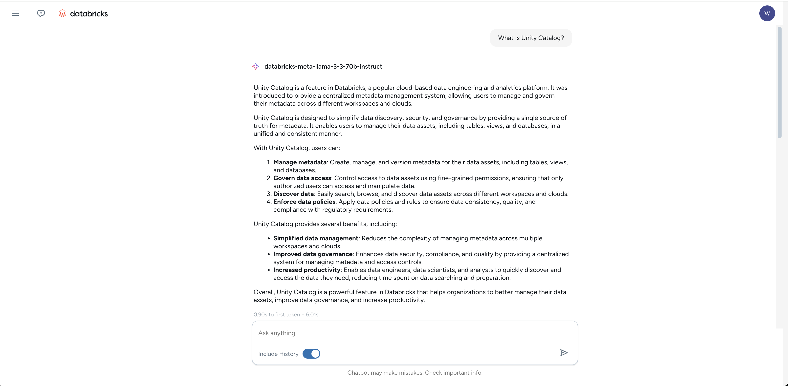

# Databricks Chatbot Application

Chat applications powered by Databricks' model serving endpoints. This project provides a foundation for creating interactive chat interfaces that leverage Databricks' powerful AI framework and model serving infrastructure.

## Features

- 🚀 Real-time chat interface
- 💾 Chat history persistence
- 🔄 Message regeneration capability
- ⚡ Streaming responses
- 🔒 Secure authentication
- 🎯 Rate limiting and error handling

## Architecture

The application is built with:
- FastAPI for the backend API
- SQLite for chat history storage
- Async/await patterns for efficient request handling
- Dependency injection for clean code organization

## Getting Started

1. Clone the repository
2. Install dependencies:
```bash
pip install -r requirements.txt
```

3. Building the Frontend

[1]. Navigate to the frontend directory:

```bash
cd frontend
```

[2]. Install dependencies:

```bash
npm install
```

[3]. Build the production version:

```bash
npm run build
```

4. Run the application:
```bash
python main.py
```

## Example Interface

Here's how the chat interface looks like



## Key Components

- `main.py`: FastAPI application entry point
- `utils/`: Helper functions and utilities
- `models.py`: Data models and schemas
- `chat_database.py`: Database interactions
- `token_minter.py`: Authentication handling
