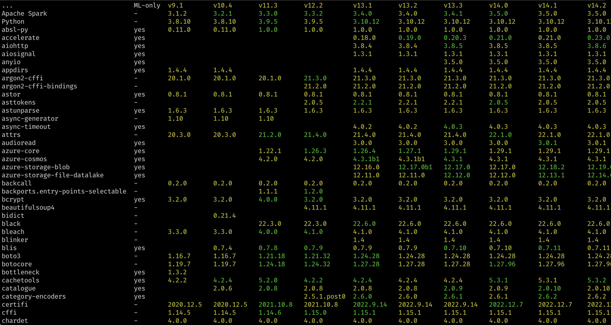

# Discovery tool for package versions in Databricks Runtimes

## Usage
  runtime-packages [flags]

## Flags

Connectivity:
 * `--profile string` Connection profile specified within ~/.databrickscfg.
 * `--host string` Databricks workspace host

Output behavior:
 * `--cluster-id string` Databricks interactive cluster to run package discovery job. Shows packages only for one runtime.
 * `--instance-pool-id string` Instance pool to run discovery. Scans all listed Databricks Runtime Versions and stores them in the cache.
 * `--json` output in JSON instead of a table.
 * `--include-java` include JVM packages in the output table.
 * `--include-ml` include Databricks Runtime for Machine Learning packages in the output table (default true).
 * `--include-python` include Python packages in the output table (default true).
 * `--last-runtimes int` maximum number of Databricks Runtime versions to display (default 10).
 * `--lts` only include Databricks Runtimes with the long-term support.

# Building from source

 * `make dist`
 * run `dist/runtime-packages`