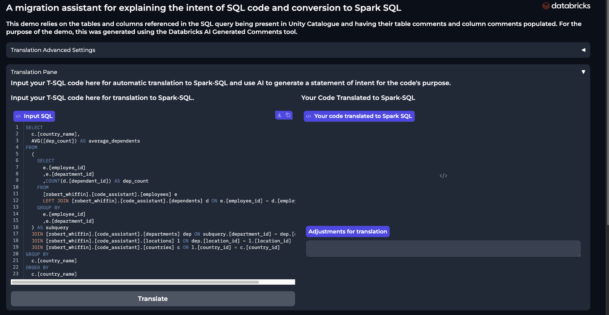
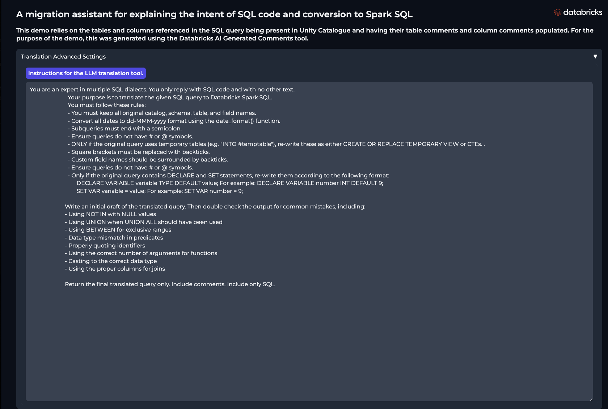
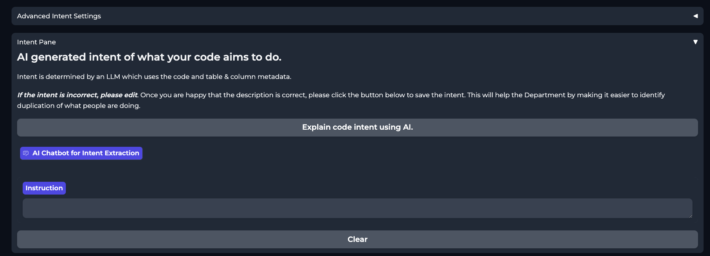
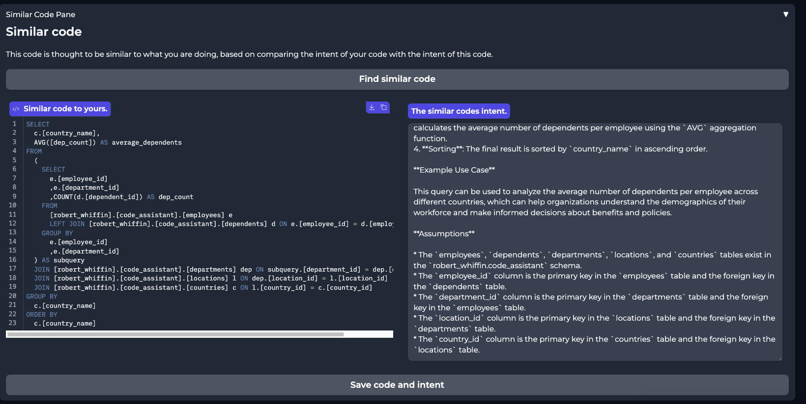

Using Legion
####################

Usage of Legion is simple; paste code into the editor, and press the "Translate"
button. The code will be automatically translated into the target language. and presented
in the output window.

Once you have translated your code, you can copy and paste it into Databricks to run it.
Coming soon this will be automated.

Migration SMEs and advanced users will need to tune the system prompt to get the best
performance for the translation. This is done in the Advanced tab above the Translation
screen. This is the example prompt included for a T-SQL to Spark SQL translation.

The next step is to extract the intent of the code. This is done by clicking the "Extract
Intent" button. This will present the intent back to the user in the below chat screen.
The chat interface allows the user to refine the intent statement in conversation with
the AI Agent. As with code translation, the Advanced tab can be used to tune the system
prompt, for example to add in business specific knowledge such as acronyms or domain jargon.

Finally, the user will click the "Save intent and code" button once the intent is refined.
This will store the intent and code in the database for future reference and discoverability.

